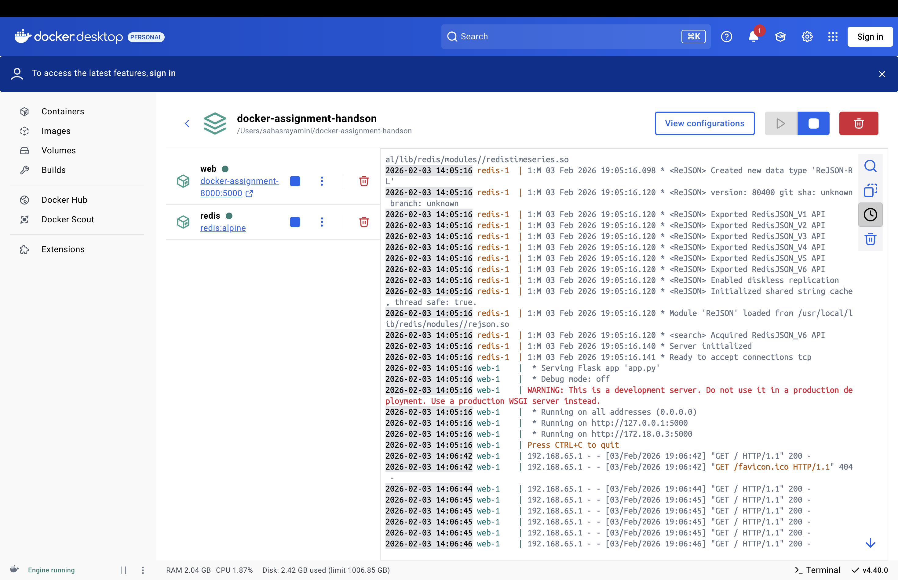
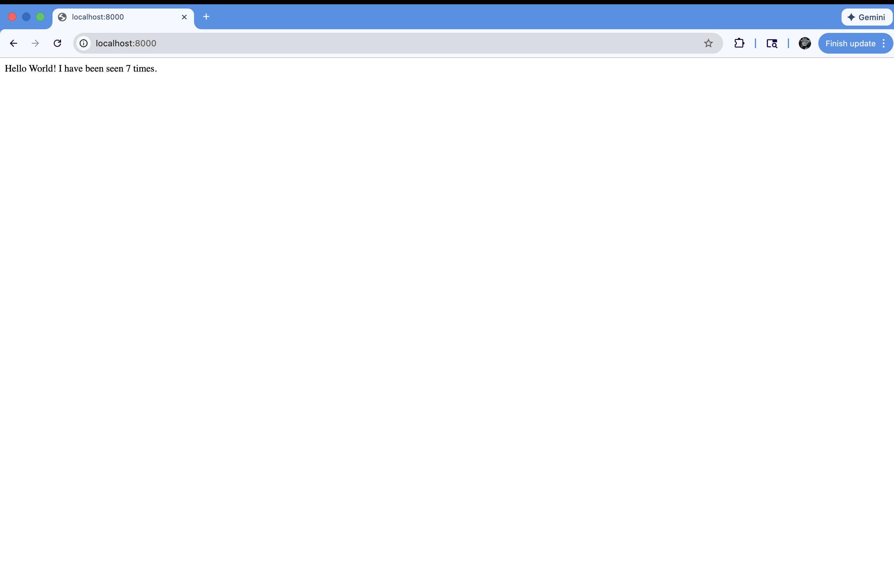

# Hands-On L3 – Docker Multi-Container Application

## Execution Steps

### 1. Install Docker Desktop

Download and install Docker Desktop from the official website for your operating system.

### 2. Clone the Repository

```bash
git clone https://github.com/yaminibuyya27/hands-on-l3-docker.git
```

### 3. Navigate to the Project Folder

```bash
cd hands-on-l3-docker
```

### 4. Build and Run the Multi-Container Application

```bash
docker compose up --build
```

This command will:

- Build the Flask application image
- Pull the Redis image from Docker Hub
- Start both containers
- Create a network for container communication

### 5. Access the Application

Open your browser and navigate to:

```
http://localhost:8000
```

### 6. Stop the Application

To stop the running containers, press `Ctrl+C` in the terminal, or run:

```bash
docker compose down
```

## Output

The application displays a hit counter that increments with each page refresh. The counter value persists in Redis, demonstrating inter-container communication.

## What I Learned

### Docker Fundamentals

- **Docker Desktop**: Local development environment for building and running containers
- **Docker Images**: Immutable templates used to create containers
- **Docker Containers**: Lightweight, isolated runtime environments

### Docker Compose

- **Multi-container orchestration**: Managing multiple services with a single configuration file
- **docker-compose.yml**: Declarative syntax for defining services, networks, and volumes
- **Service dependencies**: How containers communicate within the same Docker network

### Container Networking

- **Default bridge network**: Docker Compose creates a network for service-to-service communication
- **Service discovery**: Containers can communicate using service names as hostnames
- **Port mapping**: Exposing container ports to the host machine

### Application Architecture

- **Flask web application**: Python web framework running in one container
- **Redis database**: In-memory data store running in a separate container
- **Stateless application with persistent storage**: Web app doesn't store state; Redis handles data persistence

### Key Docker Commands Used

```bash
# Build and start containers
docker compose up --build

# List running containers
docker ps

# View logs
docker compose logs

# Stop and remove containers
docker compose down

# Stop containers but keep data
docker compose stop
```

## Screenshots

### Docker Containers



### Application Output


